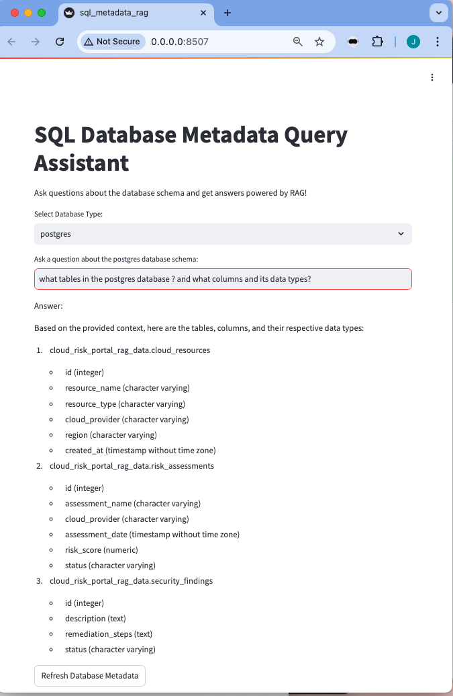

# llm_rag_mini_projects
RAG mini projects with fundational models FMs

 # Query data using RAG in prompt not SQL

 ## To use commands

 ## - Folder query_rag_data

 ## 1. Requires --> query_rag_data % brew install duckdb 

 ## 2. Install App -->  query_rag_data % bash -x run-app.sh

 ## 3. Launch app --> https://localhost:8507

