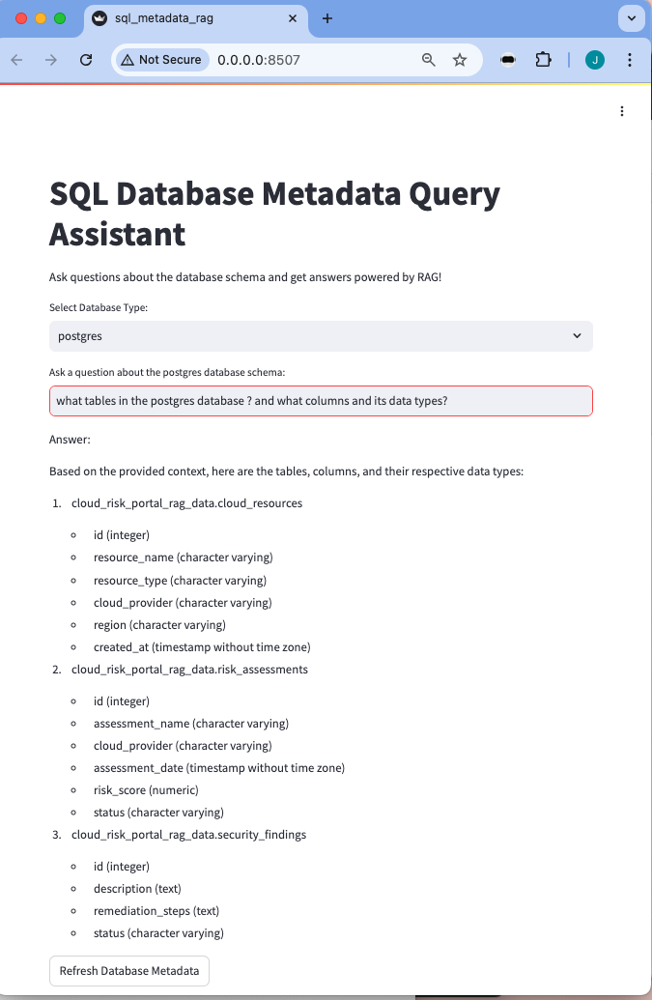

 # Query data using RAG in prompt not SQL

 ## To use commands in folder --> query_rag_data
 ```
 cd query_rag_data
 ```

 ## 1. Requires -->
 ```
 brew install duckdb
 ```

 ## 2. Install App -->
 ```
 ./run-app.sh
 ```

 ## 3. Launch app --> https://localhost:8507


